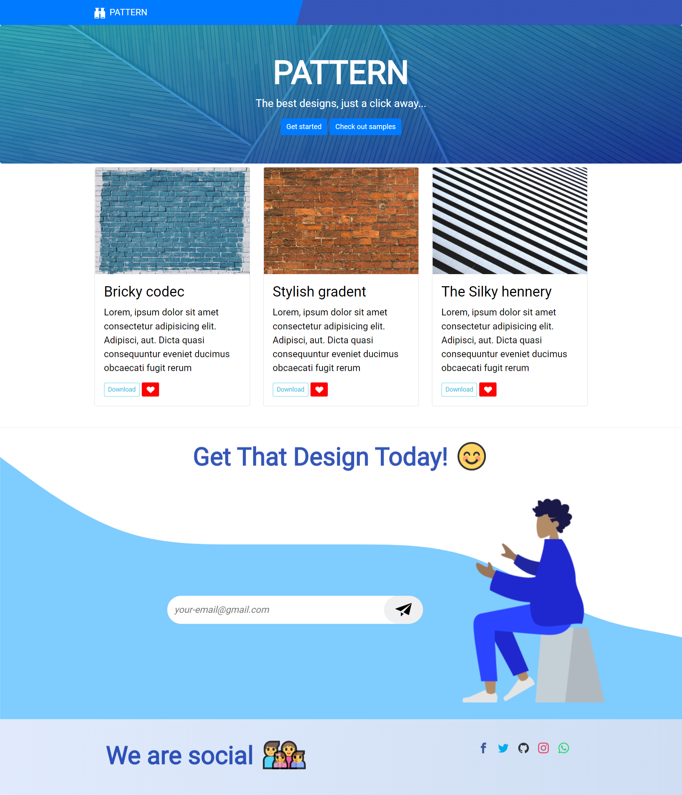

# 
 Hey 🙂, Welcome! 👋

## 
Pattern &mdash; The Best Illustrative Patterns

###Desktop view 👇: 

##About Me
Hey 🖐, I am Simeon Udoh 🙋‍♂️, A beginner frontend developer. Yes, I don't bite... So go follow me on 👇: 
+  [Twitter](https://twitter.com/Techviberng)
+   [Facebook](https://facebook.com/Simeon.udoh.71)
+   [Instagram](https://instagram.com/simicode) 

(**I'd appreciate** 😉)

Also,  you can follow me on [Github](https://github.com/simeon4real) or you can view my works: 

## Contributing 🤝
If you feel most of the styles are redundant and can be improved or any other issue that needs to be addressed, please do not hesitate to open a pull request and fix it! Feel free to fork and use offline too 🙌

## Tools used ⛏: 
* HTML5
* CSS3
* ~~SASS~~
* ~~NPM~~
* BEM
* ICOMOON SVG ICONS
* BOOTSTRAP 4 

**Link to LIVE page 👉:** https://simeon4real.github.io/Frontendmentor-challenge/ 

